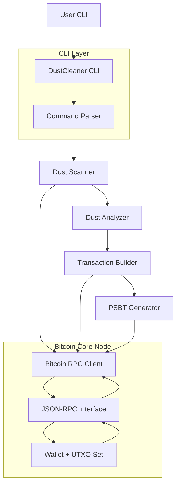

## DustCleaner


DustCleaner is a Bitcoin Core–integrated CLI tool for detecting, analyzing, and safely cleaning **dust UTXOs** from your wallet.

Dust UTXOs are very small outputs (often a few hundred sats) that are uneconomical to spend. Attackers sometimes send dust to many addresses to try to track wallet clusters when victims later consolidate those outputs. Left unmanaged, dust can:

- Bloat your UTXO set and increase future transaction fees
- Weaken privacy by linking multiple addresses when consolidated
- Create confusing wallet states (many tiny outputs with no real value)

DustCleaner helps you **find, understand, and clean dust safely** using Bitcoin Core RPC.

---

## Why This Exists

Bitcoin uses the **multi-input ownership heuristic**: when a transaction spends multiple inputs together, observers typically assume those inputs belong to the same wallet. Dust attacks exploit this by:

- Sending **tiny outputs** (dust) to many of your addresses
- Hoping you later **consolidate** those dust UTXOs in a single transaction
- Using the resulting multi-input transaction to **link your addresses on-chain**

This harms wallet privacy by revealing clusters of addresses that likely belong to the same user. DustCleaner helps by:

- Scanning your wallet for tiny, suspicious UTXOs
- Highlighting dust clusters and attack-like patterns
- Letting you safely construct, export, sign, and broadcast cleanup transactions **on your terms**

---

## Table of Contents

- [Overview](#dustcleaner)
- [Features](#features)
- [Example Demo Output](#example-demo-output-regtest)
- [Architecture Diagram](#architecture-diagram)
- [Quickstart](#quickstart)
- [Installation](#installation)
- [Dust Threshold Logic](#dust-threshold-logic)
- [Security Notes](#security-notes)
- [Privacy Considerations](#privacy-considerations)
- [Example Use Cases](#example-use-cases)
- [Commands Overview](#commands-overview)
- [CLI Help](#cli-help)
- [Background Reading](#background-reading)
- [License](#license)

## Features

- **Multi-network support**
  - Bitcoin **mainnet**
  - **testnet**
  - **regtest**
  - **signet**

- **Dust detection**
  - Script-type aware thresholds:
    - **P2PKH**: 546 sats  
    - **P2WPKH**: 294 sats  
    - **P2TR**: ~330 sats  
  - Automatic filtering of zero-value / unspendable outputs
  - Clustering by transaction and address to detect attack patterns

- **UTXO scanning**
  - Wallet UTXO enumeration via Bitcoin Core RPC (`listunspent`)
  - Flexible output modes (table, summary, verbose, JSON)

- **Dust cleanup construction**
  - Builds consolidation transactions from selected dust UTXOs
  - Fee estimation using sat/vbyte fee rate
  - Script-type aware dust protection on outputs

- **PSBT workflows**
  - **`export-psbt`**: build and export PSBT for hardware wallets / external signers
  - BIP174-compliant PSBTs, compatible with modern wallet tooling
  - Works with popular hardware wallets such as **Ledger**, **Coldcard**, and **Trezor**
  - Compatible with Bitcoin Core PSBT commands:
    - `walletprocesspsbt`
    - `finalizepsbt`

- **Signing & broadcast**
  - PSBT signing via Bitcoin Core
  - Finalization and broadcast of cleanup transactions
  - Clear summary of fees, inputs, and dust removed

- **Dust simulation (regtest)**
  - Automated dust attack simulation on regtest
  - Creates many small UTXOs, runs detection, and builds cleanup transactions
  - Useful for demos, CI, and regression testing

- **Explain & analysis**
  - `explain` command with:
    - Per-UTXO **risk scoring** (LOW / MEDIUM / HIGH)
    - Reasons and details (multi-output attack, address clustering, thresholds)
  - Clustering analysis:
    - By originating transaction
    - By address
    - By small/equal-value outputs

- **Automated regtest harness**
  - One-shot script (`test_regtest.sh`) that:
    - Spins up a clean regtest wallet state
    - Mines blocks and simulates dust
    - Runs full scan → detection → PSBT → broadcast → verification flow

---

## How It Works

DustCleaner’s workflow can be viewed in three phases:

1. **Scan**
   - Connects to Bitcoin Core over RPC
   - Retrieves wallet UTXOs using `listunspent`

2. **Analyze**
   - Applies **script-type aware dust thresholds** (P2PKH, P2WPKH, P2TR, etc.)
   - Identifies suspicious **clusters of small outputs** by transaction and address
   - Assigns risk levels and explanations for each flagged UTXO

3. **Clean**
   - Constructs consolidation transactions from selected dust UTXOs
   - Exports BIP174 PSBTs for external or hardware-wallet signing
   - Allows signing and broadcasting of cleanup transactions via Bitcoin Core

---

## Example Demo Output (regtest)

Below is an example of DustCleaner running through a full regtest test sequence:

```text
=== Dustcleaner Regtest Testing Procedure ===

Step 1: Checking Bitcoin Core connection and configuration
✓ Bitcoin Core is running
✓ Block rewards are enabled (found wallet(s) with balance)

Step 2: Resetting wallet for clean test environment
✓ Wallet 'dusttest' is ready (clean state)

Step 3: Getting new address and mining initial blocks
Address: bcrt1q0mm57h7mjdnfgtts9ydq63khlrvh4kt38chqeu
✓ Mined 201 blocks
Wallet balance: 4.93 BTC

Step 4: Testing initial scan
TXID  VOUT  VALUE(sats)  ADDRESS

Total spendable UTXOs: 101
Dust UTXOs detected: 0

Step 7: Simulating dust attack (creating multiple small UTXOs)
Current wallet balance: 4.98 BTC
Creating 10 dust UTXOs of ~300 sats each...
✓ Created 10 dust UTXOs and confirmed

Step 8: Running dust detection
TXID               VOUT  VALUE(sats)  ADDRESS
----               ----  -----------  -------
2a4c7085...        1     300          bcrt1q0mm57...
379032ed...        1     300          bcrt1q0mm57...
...                ...   ...          ...

Total spendable UTXOs: 113
Dust UTXOs detected: 10

Step 12: Testing export-psbt command
✓ PSBT exported to cleanup.psbt

Step 14: Finalizing and broadcasting
Cleanup transaction ID: 266a0288a21a522d284d...
✓ Transaction broadcasted and confirmed

Step 15: Verifying dust removal
TXID  VOUT  VALUE(sats)  ADDRESS

Total spendable UTXOs: 107
Dust UTXOs detected: 0
```

This demonstrates the full lifecycle: **simulate dust → detect → build PSBT → export → sign → broadcast → verify dust removed**.

---

## Architecture Diagram



**Components:**

- **User CLI** (shell, scripts, automation)
- **DustCleaner CLI** (`dustcleaner` binary)
- **CLI Layer / Command Parser** (argument parsing, command dispatch)
- **Dust Scanner** (UTXO scan via Bitcoin Core RPC)
- **Dust Analyzer** (script-aware thresholds, clustering, risk scoring)
- **Transaction Builder** (cleanup transaction construction, fee estimation)
- **PSBT Generator** (PSBT creation/export for external signing)
- **Bitcoin RPC Client** (`rpc` package, JSON-RPC over HTTP)
- **Bitcoin Core Node** (full node with JSON-RPC)
- **Wallet + UTXO Set** (Bitcoin Core wallet state)

---

## Quickstart

### 1-minute setup

```bash
git clone https://github.com/charlesoma/dustcleaner.git
cd dustcleaner

# Build binary (adjust if you prefer plain `go build`)
make            # or: go build -o dustcleaner .

# Basic scan against a regtest node
./dustcleaner scan --network regtest --rpc-url http://127.0.0.1:18443 --wallet dusttest
```

Make sure you have:

- A Bitcoin Core node running with RPC enabled
- For regtest, something like:

```bash
bitcoind -regtest -daemon
```

### Full regtest test harness

The project includes an automated regtest harness that runs a full end-to-end scenario:

```bash
./test_regtest.sh
```

This will:

1. Validate the regtest environment and block rewards  
2. Reset/create the `dusttest` wallet  
3. Mine blocks to fund the wallet  
4. Run initial scans  
5. Simulate a dust attack  
6. Detect dust and build cleanup transactions  
7. Export PSBT, sign, broadcast, and verify dust removal  

---

## Installation

### From source

Requires **Go 1.21+**.

```bash
git clone https://github.com/charlesoma/dustcleaner.git
cd dustcleaner

go build -o dustcleaner .
```

### Using `go install`

```bash
go install github.com/charlesoma/dustcleaner@latest
```

This installs `dustcleaner` into your `$GOBIN` (typically `$HOME/go/bin`), so you can run it globally as:

```bash
dustcleaner scan
```

---

## Dust Threshold Logic

DustCleaner uses **script-type aware** thresholds instead of a single hardcoded value. Thresholds roughly track Bitcoin Core’s dust policy:

- **P2PKH** (legacy): `546 sats`
- **P2WPKH** (bech32): `294 sats`
- **P2TR** (Taproot): `~330 sats`
- **P2SH / P2WSH**: treated conservatively (similar to P2PKH/P2SH)

Detection logic:

- Determine script type from `scriptPubKey` or address format  
- Apply the correct threshold for that script type  
- Flag UTXOs:
  - Below the threshold
  - Or part of suspicious clusters (many small outputs, equal values, address clustering)

This allows more precise dust detection and avoids misclassifying valid change outputs for modern script types.

---

## Security Notes

DustCleaner is designed with conservative, wallet-safe defaults:

- **No surprise broadcasts**
  - Cleanup transactions are only broadcast after explicit steps:
    - For `cleanup` / `export-psbt`, you can require confirmation (`--confirm`)
    - Dry-run mode (`--dry-run`) shows what would happen without building/broadcasting

- **PSBT-first workflow**
  - Supports exporting **PSBT** files (`export-psbt`) so you can:
    - Inspect transactions
    - Sign with hardware wallets or external tools
    - Use Bitcoin Core’s PSBT pipeline (`walletprocesspsbt`, `finalizepsbt`)
  - This avoids exposing private keys to DustCleaner itself.

- **Wallet scope**
  - Interacts only with **your own Bitcoin Core wallet** via RPC
  - UTXOs are selected from the configured wallet (`--wallet` / config file)
  - Warnings for:
    - UTXOs without address fields
    - Consolidating across multiple addresses (privacy impact)

- **Fee and dust guardrails**
  - Enforces:
    - Maximum fee caps (`--max-fee`)
    - Minimum confirmation counts (`--min-confs`)
    - Output value above dust threshold

If a transaction would be uneconomical or would produce dust again, DustCleaner **refuses to build it**.

---

## Privacy Considerations

Consolidating UTXOs **links their addresses on-chain** via the common-input heuristic, which can weaken your privacy if you merge funds from unrelated sources.

When using DustCleaner, you may want to:

- Consolidate only **within address clusters** you are comfortable linking
- Use **CoinJoin or mixing tools** before, after, or instead of consolidation
- **Leave suspicious dust unspent** if you do not trust its origin

DustCleaner will highlight clustering and linkage risks, but it does **not** enforce privacy decisions automatically. You control which UTXOs to consolidate and when to broadcast cleanup transactions.

---

## Example Use Cases

- **Dust attack detection**
  - Identify classic dust-attack patterns:
    - Many small equal-value outputs from a single transaction
    - Clusters of small outputs to the same address
    - Suspicious unconfirmed dust in the mempool

- **Wallet cleanup**
  - Consolidate small UTXOs into a single, non-dust output
  - Reduce future fee overhead by shrinking the UTXO set

- **UTXO consolidation**
  - Group small UTXOs by address or cluster and clean them with different strategies:
    - **Fast** mode: single transaction (cheaper, less private)
    - **Privacy** or **isolated** modes: cluster-aware or per-address transactions

- **Privacy analysis**
  - Use the `explain` command to:
    - See which UTXOs are risky
    - Understand clustering and linkage implications
    - Decide whether to spend or ignore certain dust

---

## Commands Overview

```bash
dustcleaner scan          # Scan wallet UTXOs and detect dust
dustcleaner cleanup       # Build cleanup transaction(s) for dust UTXOs
dustcleaner export-psbt   # Build cleanup transaction(s) and export PSBT(s)
dustcleaner simulate-dust # Simulate a dust attack on regtest
dustcleaner explain       # Explain why specific UTXOs were flagged as dust
```

Each command supports common flags such as:

- `--network` (`mainnet`, `testnet`, `regtest`, `signet`)
- `--rpc-url`, `--rpc-user`, `--rpc-pass`
- `--wallet`
- Mode- and safety-related flags (`--fee-rate`, `--min-confs`, `--max-fee`, `--dry-run`, `--confirm`, etc., depending on the command)

---

## CLI Help

```bash
./dustcleaner --help
```

Example output:

```text
DustCleaner - Bitcoin dust detection and cleanup tool

Usage:
  dustcleaner [command]

Available Commands:
  scan           Scan wallet UTXOs and detect dust
  cleanup        Build cleanup transactions for dust UTXOs
  export-psbt    Export cleanup transaction as PSBT
  simulate-dust  Simulate dust attack (regtest only)
  explain        Explain detected dust patterns
```

---

## Background Reading

For developers who want to dig deeper into the underlying concepts:

- **Dust attacks and address clustering** – how tiny outputs are used to link wallets via the common-input heuristic
- **BIP174: Partially Signed Bitcoin Transactions** – the PSBT standard used for hardware-wallet and multi-step signing flows
- **Bitcoin Core dust policy** – how the node defines uneconomical outputs and enforces relay rules
- **UTXO set research and mempool analysis** – understanding UTXO growth, fee pressure, and spam/dust patterns on the network

---

## License

DustCleaner is released under the **MIT License**.

You are free to use, modify, and distribute this software under the terms of the MIT license.

